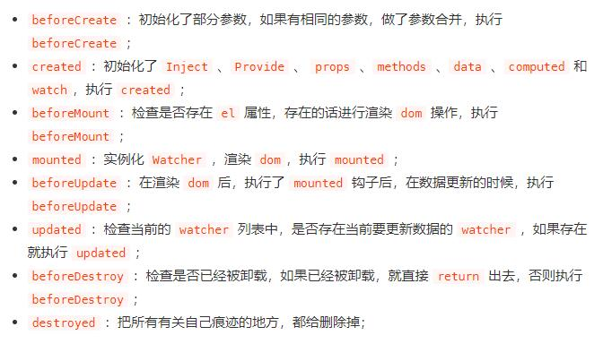

# 1. Vue

## 1.1 Vue生命周期


- 各个周期都干了什么



## 1.2 Vue性能优化方法

1. 路由懒加载
2. keep-alive缓存页面
3. v-show复用DOM（复杂的组件）
4. v-for遍历避免v-if(v-for的优先级高于v-if，这样会无论是否v-if都需要遍历)
5. 长列表性能优化

``` javascript
// 1. 如果只是存粹的数据展示，就不需要做响应式
data () {
  return {
    users: []
  }
},
methods: {
  async getUsers () {
    const users = await axios.get('/api/user)
    this.users = Object.freeze(users)
  }
}
// 2. 大数据长列表，可以虚拟滚动，只渲染部分区域的内容
vue-virtual-scroller/vue-virtual-scroll-list
```

6. 事件的销毁（一些timer啥的）
7. 图片的懒加载
8. 第三方插件按需引用
9. 无状态的组件标记为函数式组件

``` javascript
<template functional>
  <div></div>
</template>
```

10. 子组件的分割（减少一个页面的压力）
11. SSR
