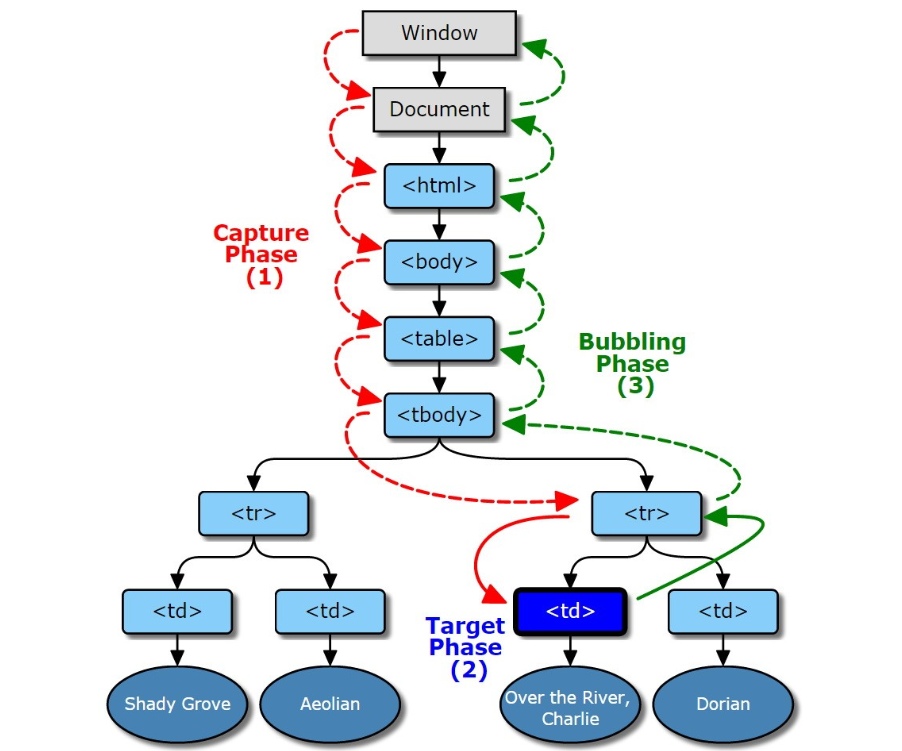
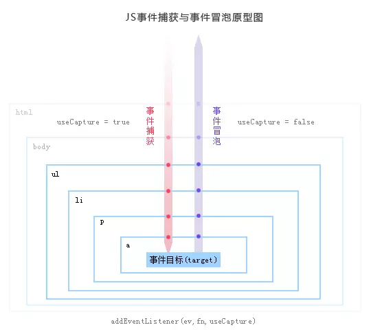
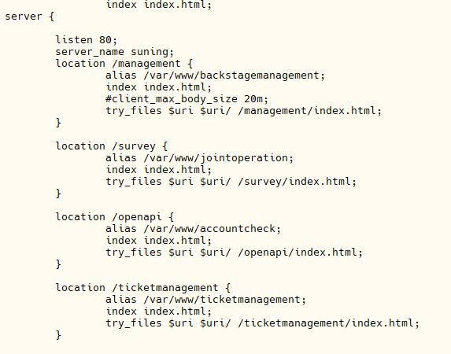
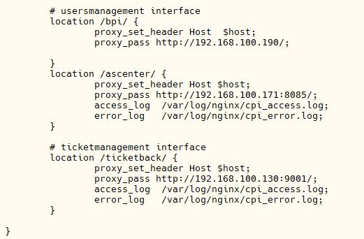

# 1 浏览器知识总结01

## 1.1 事件机制

### 1.1.1 事件触发三阶段



- 红色代表捕获阶段：**window**往事件触发处传播，遇到注册的捕获事件会触发。
- 蓝色代表目标阶段：传播到事件触发处时触发注册的事件。
- 绿色代表冒泡阶段：从事件触发处往**window**传播，遇到注册的冒泡事件会触发

### 1.1.2 注册事件

> element.addEventListener(event, function, useCapture)

```js
/**
 * addEventListener
 * @param event {String} 指定事件名称
 * @param function {Funtion} 事件触发执行的函数
 * @param useCapture {Boolean} 事件在捕获阶段还是冒泡阶段，默认false(冒泡阶段)
*/
element.addEventListener(event, function, useCapture)
```

### 1.1.3 event.stopPropagation()和event.stopImmediatePropagation()和event.preventDefault()

- event.stopPropagation()用于阻止冒泡,但是不会阻止相同事件的其他侦听器被调用。
- event.stopImmediatePropagation用于阻止冒泡，并且阻止相同事件的其他侦听器被调用。
- event.preventDefault()用于阻止默认事件。

```js
// event.stopImmediatePropagation()
<!DOCTYPE html>
<html>
    <head>
        <style>
            p { height: 30px; width: 150px; background-color: #ccf; }
            div {height: 30px; width: 150px; background-color: #cfc; }
        </style>
    </head>
    <body>
        <div>
            <p>paragraph</p>
        </div>
        <script>
            const p = document.querySelector('p')
            p.addEventListener("click", (event) => {
              alert("我是p元素上被绑定的第一个监听函数");
            }, false);

            p.addEventListener("click", (event) => {
              alert("我是p元素上被绑定的第二个监听函数");
              event.stopImmediatePropagation();
              // 执行stopImmediatePropagation方法,阻止click事件冒泡,并且阻止p元素上绑定的其他click事件的事件监听函数的执行.
            }, false);

            p.addEventListener("click",(event) => {
              alert("我是p元素上被绑定的第三个监听函数");
              // 该监听函数排在上个函数后面，该函数不会被执行
            }, false);

            document.querySelector("div").addEventListener("click", (event) => {
              alert("我是div元素,我是p元素的上层元素");
              // p元素的click事件没有向上冒泡，该函数不会被执行
            }, false);
        </script>
    </body>
</html>
```

## 1.2 事件委托(事件代理)



### 1.2.1 原理

- 事件委托利用的是事件冒泡的原理，将事件注册在事件目标（事件源）的上层级。当事件目标（事件源）触发事件后会向上冒泡，然后执行注册的事件。

### 1.2.2 好处

1. 效率高，管理的函数变少了，不必为每一个元素都添加监听函数。
2. 可以方便地动态添加和修改元素，不需要因为元素的改动修改绑定的事件。
3. JavaScript和DOM节点之间的关联变少了，这样降低了因为循环而带来的内存泄漏的发生概率。

### 1.2.3 例子

```js
// html
<div id="parent">
  <div>
    <ul>
      <li>111</li>
      <li>222</li>
      <li>333</li>
      <li>444</li>
    </ul>
  </div>
</div>

// js
let eleParent = document.getElementById("parent");
eleParent.onmouseover = ev => {
  ev = ev || window.event;
  let eleTarget = ev.srcElement || ev.target;
  if (eleTarget.nodeName.toLowerCase() === "li") {
    eleTarget.style["color"] = "red";
  }
};
eleParent.onmouseout = ev => {
  ev = ev || window.event;
  let eleTarget = ev.srcElement || ev.target;
  if (eleTarget.nodeName.toLowerCase() === "li") {
    eleTarget.style["color"] = "#333333";
  }
}
```

## 1.3 跨域

### 1.3.1 同源政策(SOP)

> 同源政策（Same Origin Policy）是一种约定，他是浏览器最核心合适最基本的安全功能，如果缺少了SOP，浏览器很容易受到XSS/CSFR等攻击。所谓同源就是值“协议 + 域名 + 端口”三者相同，即便两个域名指向同一个IP，也并非同源。

(1) 以<https://cheng5_du.coding.me>同源检测示例：

|URL|结果|原因|
|------|------|--------|
|<https://cheng5_du.coding.me/post>|成功|只是路径不同|
|<http://cheng5_du.coding.me>|失败|协议不同|
|<https://cheng5_du.coding.me:81>|失败|端口不同|
|<https://cheng5_du.coding.you>|失败|域名不同|

(2) 同源政策限制行为：

1. Cookie,localStorage,IndexDB无法读取。
2. DOM和JS无法获取。
3. AJAX请求无法发送。

### 1.3.2 跨域解决方法

1. JSONP
2. document.domain + iframe
3. location.hash + iframe
4. window.name + iframe
5. postMessage
6. CORS
7. Nginx Proxy
8. Node middleware
9. WebSocket

#### 1.3.2.1 JSONP

> html中的script/link/img标签支持跨域，浏览器对其没有限制。发送的请求都是get请求，get请求，get请求。

```js
// 1. 原生实现
let script = document.createElement("script");
script.type = "text/javascript";
script.src = "${url}/login?user=admin&callback=hanleCallback";
document.head.appendChild(script);
function handleCallback(res => {
  console.log(JSON.stringify(res));
})

// 2. jQuery
$.ajax({
  url: "${url}",
  type: "get",
  dataType: "jsonp",
  jsonpCallback: "handleCallback",
  data: {}
})

// Vue
this.$http.jsonp("${url}", {
  params: {},
  jsonp: "handleCallback"
}).then(res => {
  // TODO
})
```

#### 1.3.2.2 document.domain + iframe

> 此方法仅适用于主域相同，子域不同的情景。通过js强制设置${url}为基础主域，实现了同域。

```js
// 父窗口 http://www.domain.com/a.html
<iframe id="iframe" src="http://child.domain.com/b.html">
<script>
  document.domain = "domain.com";
  let user = "admin";
</script>

// 子窗口 http://child.domain.com/b.html
<script>
  document.domain = "domain.com";
  let user = window.parent.user; // admin
</script>
```

#### 1.3.2.3 location.hash + iframe

> 通过监听location的hash值改变传值等操作。

```js
// 父窗口 http://www.domain.com/a.html
<iframe id="iframe" src="http://child.domain.com/b.html">
<script>
  let iframe = document.querySelector("#iframe");
  setTimeout(() => {
    iframe.src += "#user=admin";
  }, 1000);
</script>

// 子窗口 http://child.domain.com/b.html
<script>
  window.onhashchange = () => {
    let hashVal = location.hash;
  }
</script>
```

#### 1.3.2.4 window.name + iframe

> 没用过，就不写了。

#### 1.3.2.5 postMessage

> postMessage是为数不多的可以跨域操作的window属性之一。可以用于：1.页面与打开窗口；2. 打开窗口与打开窗口；3.页面与iframe等之间的消息传递。

```js
/**
 * postMessage
 * @param data {String}
 * @param origin {String} protocol + server + port
*/
postMessage(data, origin)
```

```js
// http://www.domain.com/a.html
<iframe id="iframe" src="http://www.domain2.com/b.html"></iframe>
<script>
  let iframe = document.querySelector("#iframe");
  iframe.onload = () => {
    let data = {
      name: "cHeNg5"
    };
    // 向domain2发送数据
    iframe.contentWindow.postMessage(JSON.stringify(data), "http://www.domain2.com");
  };
  // 接收domain2返回的数据
  window.addEventListener("message", (e) => {
    console.log(e.data);
  }, false)
</script>

// http://www.domain2.com/b.html
<script>
  window.addEventListener("messge", (e) => {
    let data = JSON.parse(e.data);
    // 处理后向domain发送数据
    window.parent.postMessage("ok", "http://www.domain.com");
  }, false)
</script>
```

#### 1.3.2.6 跨域资源共享/CORS(Cross-Origin Resource Sharing)

> 普通跨域请求：只服务端设置Access-Control-Allow-Origin即可，前端无须设置，若要带cookie请求：前后端都需要设置。

```js
// 1. 原生ajax
xhr.withCredentials = true;

// 2. jQuery
$.ajax({
  ...
  xhrFields: {
    withCredentials: true
  },
  crossDomain: true
});

// 3. Vue
axios.default.withCredentials = true; // axios
Vue.http.options.credentials = true; // Vue-resource
```

#### 1.3.2.7 Nginx

- iconfont

```js
location / {
  add_header Access-Control-Allow-Origin *;
}
```

- 反响代理接口

```js
server {
  listen 80;
  server_name cheng5_du.coding.me;
  location / {
    proxy_pass www.xxx.com:808; // 反响代理
    proxy_cookie_domain wwww.xxx.com cheng5_du.coding.me; //修改cookie域名
    index index.html index.htm;

    // 当用webpack-dev-server等中间件代理接口访问nignx时，此时无浏览器参与，故没有同源限制，下面的跨域配置可不启用
    add_header Access_Control_Allow_Origin cheng5_du.coding.me; // 如果前端只跨域不带cookie，可以设置为*
    add_header Access_Control_Allow_Credentials true;
  }
}
```

##### 1.3.2.7.1 Nginx配置




- 前一张是配置线上项目的服务，起项目。
- 后一张适用于反响代理配置接口。

#### 1.3.2.8 Node MiddleWare

```js
// 前端代码

var xhr = new XMLHttpRequest();
// 前端开关：浏览器是否读写cookie
xhr.withCredentials = true;
// 访问http-proxy-middleware代理服务器
xhr.open('get', 'https://cheng5_du.coding.me', true);
xhr.send();

// Node
var express = require('express');
var proxy = require('http-proxy-middleware');
var app = express();

app.use('/', proxy({
    // 代理跨域目标接口
    target: 'http://www.domain2.com:8080',
    changeOrigin: true,

    // 修改响应头信息，实现跨域并允许带cookie
    onProxyRes: function(proxyRes, req, res) {
        res.header('Access-Control-Allow-Origin', 'https://cheng5_du.coding.me');
        res.header('Access-Control-Allow-Credentials', 'true');
    },

    // 修改响应信息中的cookie域名
    cookieDomainRewrite: 'https://cheng5_du.coding.me'  // 可以为false，表示不修改
}));

app.listen(3000);
console.log('Proxy server is listen at port 3000...');
```

#### 1.3.2.9 WebSocket

> WebSocket protocol是HTML5一种新的协议。它实现了浏览器与服务器全双工通信，同时允许跨域通讯，是server push技术的一种很好的实现。

```js
// 前端代码
<div>user input：<input type="text"></div>
<script src="https://cdn.bootcss.com/socket.io/2.2.0/socket.io.js"></script>
<script>
var socket = io('http://www.domain2.com:8080');
// 连接成功处理
socket.on('connect', function() {
    // 监听服务端消息
    socket.on('message', function(msg) {
        console.log('data from server: ---> ' + msg); 
    });
    // 监听服务端关闭
    socket.on('disconnect', function() { 
        console.log('Server socket has closed.'); 
    });
});
document.getElementsByTagName('input')[0].onblur = function() {
    socket.send(this.value);
};
</script>

// Node
var http = require('http');
var socket = require('socket.io');
// 启http服务
var server = http.createServer(function(req, res) {
    res.writeHead(200, {
        'Content-type': 'text/html'
    });
    res.end();
});
server.listen('8080');
console.log('Server is running at port 8080...');
// 监听socket连接
socket.listen(server).on('connection', function(client) {
    // 接收信息
    client.on('message', function(msg) {
        client.send('hello：' + msg);
        console.log('data from client: ---> ' + msg);
    });
    // 断开处理
    client.on('disconnect', function() {
        console.log('Client socket has closed.'); 
    });
});
```

## 1.4 存储

|特性|cookie|session|localStorage|sessionStorage|indexDB|
|---------|---------|---------|---------|---------|---------|
|数据生命周期|服务器生成，可以设置过期时间|服务器生成，可以设置过期时间|除非被清除，否则一直存在|页面关闭清除|除非被清除，否则一直存在|
|数据存储大小|4k|没限制，但放在服务器内存中，太多会影响性能|5M|5M|没限制|
|与服务端通信|每次都会放在请求头header中，对请求性能没影响|本身信息放在服务器|不参与|不参与|不参与|

### 1.4.1 cookie与session

- cookie存放在客户端，每次发出HTTP请求的时候，会带上信息。所以不是很安全。
- session存放在服务端，通过cookie带上sessionID查询用户信息，很安全。
