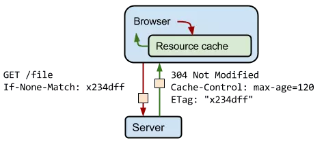

# 1 浏览器知识总结02

## 1.1 浏览器缓存机制

> 缓存时性能优化中简单高效的一种方式，它可以显著的减少网络请求传输带来的损耗。

- 一个数据请求的过程，可以分为网络请求，后端处理，浏览器响应三个阶段。而浏览器缓存机制可以帮助我们在第一步和第三部中性能优化。接下来从这几个方面探讨：1.缓存位置；2.缓存策略；3.实际应用场景。

### 1.1.1 缓存位置

> 各个缓存的位置有自己的优先级，当依次都没有命中的时候，才会去进行网路请求。其分类如下：

1. Service Worker
2. Memory Cache
3. Dist Cache
4. Push Cache
5. 网络请求

#### 1.1.1.1 Service Worker

> Service Worker是运行在浏览器背后的独立线程，一般可以用来实现缓存功能。本质上充当了Web应用程序与浏览器之间的代理服务器。它旨在能够创建有效的离线体验，拦截网络请求并基于网络是否可用及更新的资源是否驻留在服务器上来采取适当的动作。他们还允许访问推送通知和后台同步API。

- 出于安全考虑，Service Workers只能由HTTPS承载，修改网络请求的能力暴露给中间人攻击会非常危险。

**注意：**

1. Service Workers优先于同类尝试（如AppCache），因为他们无法支持当操作出错时终止操作，而Service Workers可以更加细致地控制每一件事情。
2. Service Workers大量使用Promise，因为通常它们会等待响应后继续，并根据响应返回一个成功或者失败的操作。


- Service Workers使用步骤：[MDN梯子](https://developer.mozilla.org/zh-CN/docs/Web/API/Service_Worker_API/Using_Service_Workers)

1. service worker URL 通过 serviceWorkerContainer.register() 来获取和注册。
2. 如果注册成功，service worker 就在 ServiceWorkerGlobalScope 环境中运行； 这是一个特殊类型的 woker 上下文运行环境，与主运行线程（执行脚本）相独立，同时也没有访问 DOM 的能力。
3. service worker 现在可以处理事件了。
4. service worker 控制的页面打开后会尝试去安装 service worker。最先发送给 service worker 的事件是安装事件(在这个事件里可以开始进行填充 IndexDB和缓存站点资源)。这个流程同原生 APP 或者 Firefox OS APP 是一样的 — 让所有资源可离线访问。
5. 当 oninstall 事件的处理程序执行完毕后，可以认为 service worker 安装完成了。
6. 下一步是激活。当 service worker 安装完成后，会接收到一个激活事件(activate event)。 onactivate 主要用途是清理先前版本的service worker 脚本中使用的资源。
7. Service Worker 现在可以控制页面了，但仅是在 register()  成功后的打开的页面。也就是说，页面起始于有没有 service worker ，且在页面的接下来生命周期内维持这个状态。所以，页面不得不重新加载以让 service worker 获得完全的控制。

- 例子

```js
// app.js（入口文件）：注册
if ('serviceWorker' in navigator) {
  navigator.serviceWorker
    .register('/sw-test/sw.js', { scope: '/sw-test' })
    .then(function(reg) {
      console.log('service worker 注册成功')
    })
    .catch(function(err) {
      console.log('service worker 注册失败')
    })
}

// sw.js：安装/激活 =》 install事件会在安装完成之后触发。
this.addEventListener('install', function(event) {
  event.waitUntil( // 确保SW在waitUntil()里面的代码执行完毕前安装完成
    caches.open('v1').then(funtion(cache) { // 创建一个名叫v1的新的缓存
      return cache.addAll([ // 想要缓存的资源的列表
        '/sw-test/',
        '/sw-test/index.html',
        '/sw-test/app.js',
        '/sw-test/style.css'
      ])
    })
  )
})

// 拦截所有请求事件
// 如果缓存中已经有请求的数据就直接用缓存，否则去请求数据
this.addEventListener('fetch', funtion(event) {
  event.responseWith( // 劫持HTTP响应
    // 对网络请求的资源和 cache 里可获取的资源进行匹配，查看是否缓存中有相应的资源
    caches.match(event.request).then(function(res) {
      if (res) {
        // TODO
      }
      console.log('fetch source')
    })
  )
})
```

#### 1.1.1.2 Memory Cache

> 根据字面意思，就是内存中的缓存。

- 特点：

1. 内存缓存的读取速度比磁盘缓存的读取速度快。
2. 内存缓存读取速度高效，但是缓存的持续时间短，会随着进程的释放而释放（比如Tab页面的关闭，内存中的缓存也就释放了）。

- 数据能不能都存在内存中？

**不能**，这是结论。计算机中的内存比硬盘的容量要小得多，操作系统会精打细算内存的开销，内存中可以存放大部分的文件，如JS/HTML/CSS/图片等，但策略就不是很清楚了。

#### 1.1.1.3 Disk Cache

> 字面意思就是，硬盘中的缓存。读取速度比内存慢，但是什么都能储存到硬盘中，比起Memory Cache，胜在容量和存储时效上。

- 在所有的浏览器缓存中，Disk Cache的覆盖面积是最大的。它会根据HTTP Header中的字段判断哪些资源需要缓存，那些资源可以不请求直接使用，那些资源过期需要重新请求。

- 即使在跨站的情况下，相同地址的资源一旦被硬盘缓存下来，就不会再次请求数据。

|类型|说明|
|----|----|
|Memory Cache|不请求网络资源，资源在内存中，一般脚本，字体，图片会存放在内存中|
|Disk Cache|不请求网络资源，资源在硬盘中，一般非脚本会存放在硬盘中，如css样式表等|

#### 1.1.1.4 Push Cache

> Push Cache是HTTP/2中的内容，当以上三种都没有命中，他才会被使用。Push Cache的缓存时间很短，只存在Session(会话)中，一旦会话结束就被释放。

### 1.1.2 缓存策略

> 通常浏览器缓存策略分为两种：强缓存和协商缓存。缓存策略的实现都是通过设置HTTP Header。

#### 1.1.2.1 强缓存

> 强缓存可以通过设置两种HTTP Header来实现：Expires和Cache-Control。强缓存表示在缓存期间不需要再次发起请求。

##### 1.1.2.1.1 Expires

```js
Expires: Web, 12 Oct 2019 21:00:00 GMT
```

- Expires是HTTP/1的产物，表示资源会在 Web, 12 Oct 2019 21:00:00 GMT 后过期，需要再次请求。并且 Expires **受限于本地时间**，如果修改了本地时间，可能会**造成缓存失效**。

##### 1.1.2.1.2 Cache-Control

```js
Cache-Control: max-age=30
```

- Cache-Control出现在HTTP/1.1，**优先级高于Expires**。该属性表示资源在30秒后过期，需要再次请求。


#### 1.1.2.2 协商缓存

> 如果缓存过期了，就需要发起请求验证资源是否有更新。协商缓存可以通过设置两种HTTP Header实现：Last-Modified和ETag。

- 当浏览器发起请求验证资源时，如果资源没有做改变，那么服务端就会返回 304 状态码，并且更新浏览器缓存有效期。



##### 1.1.2.2.1 Last-Modified 和 If-Modified-Since

> Last-Modified 表示本地文件最后修改日期，If-Modified-Since 会将 Last-Modified 的值发送给服务器，询问服务器在该日期后资源是否有更新，有更新的话就会将新的资源发送回来，否则返回 304 状态码。

- 弊端：

1. 如果本地打开缓存文件，即使没有对文件进行修改，但还是会造Last-Modified 被修改，服务端不能命中缓存导致发送相同的资源。
2. 因为 Last-Modified 只能以秒计时，如果在不可感知的时间内修改完成文件，那么服务端会认为资源还是命中了，不会返回正确的资源。

##### 1.1.2.2.2 ETag 和 If-None-Match

> ETag 类似于文件指纹，If-None-Match 会将当前 ETag 发送给服务器，询问该资源 ETag 是否变动，有变动的话就将新的资源发送回来。并且 ETag 优先级比 Last-Modified 高。

#### 1.1.2.3 浏览器默认缓存

> 如果没有设置缓存策略，浏览器会采用一个启发式的算法，通常会取响应头中的 Date 减去 Last-Modified 值的 10% 作为缓存时间。

### 1.1.3 应用场景

#### 1.1.3.1 频繁变动的资源

- 对于频繁变动的资源，首先需要使用 Cache-Control: no-cache 使浏览器每次都请求服务器，然后配合 ETag 或者 Last-Modified 来验证资源是否有效。这样的做法虽然不能节省请求数量，但是能显著减少响应数据大小。

#### 1.1.3.2 代码文件

- 这里特指除了 HTML 外的代码文件，因为 HTML 文件一般不缓存或者缓存时间很短。

- 一般来说，现在都会使用工具来打包代码，那么我们就可以对文件名进行哈希处理，只有当代码修改后才会生成新的文件名。基于此，我们就可以给代码文件设置缓存有效期一年 Cache-Control: max-age=31536000，这样只有当 HTML 文件中引入的文件名发生了改变才会去下载最新的代码文件，否则就一直使用缓存。
