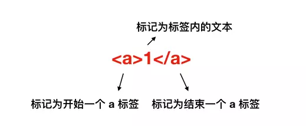

# 1 浏览器知识总结03

## 1.1 浏览器渲染原理

> 在浏览器中，执行JavaScript有JS引擎，那么执行渲染有渲染引擎（Rendering Engine）,但我们一般称之为浏览器内核。

### 1.1.1 浏览器渲染的过程

1. 浏览器将获取到的HTML文档解析成DOM（Document Object Model）树。
2. 处理CSS标记，构成层叠样式表模型CSSOM（CSS Object Model）。
3. 将DOM和CSSOM合并成渲染树（Redering Tree，代表一系列将被渲染的对象）。
4. 渲染树的每个元素包含的内容都是经过计算的，它被称为布局（layout）。浏览器使用一种流式处理的方法，只需要一次Pass绘制操作就能布局所有的元素。
5. 将渲染树的各个节点绘制到屏幕上，这一步称为Painting。

### 1.1.2 浏览器接收到 HTML 文件并转换为 DOM 树

> 当我们打开一个网页时，浏览器都会去请求对应的HTML文件。

1. HTML文档进行网络传输的时候实际的内容是0/1字节数据，所以，第一步需要将这些**字节数据转换成字符串**，也就是我们写的代码。

```js
字节数据（0/1）=》 字符串
```

2. 当数据被转换成字符串之后，浏览器会**将这些字符串通过词法分析转换成标记（Token)**，这一步在词法分析中叫做标记化（Tokenization）。

```js
字节数据（0/1）=》 字符串 =》 标记
```



3. 结束标记后，这些**标记会转换成Node**,最后这些**Node会根据不同的联系构成一个DOM数**。

```js
字节数据（0/1）=》 字符串 =》 标记 => Node => DOM
```


### 1.1.3 将 CSS 文件转换为 CSSOM 树

> 在解析HTML文档的时候，浏览器在遇到CSS文件时，浏览器会下载并解析文件。这个过程和构成DOM树的过程很相似，如下：

```js
字节数据（0/1）=》 字符串 =》 标记 => Node => CSSOM
```

- 在这个过程中，浏览器会确定每一个节点的样式到底是什么，并且这一过程十分耗性能。因为样式可以自行设置，也可能继承，所以这个过程需要递归CSSOM树。

```css
<div>
  <a>
    <span></span>
  </a>
</div>

span {
  color: #333333;
}
div > a > span {
  color: #f0ff00;
}
```

- NOTE：1. 我们应该尽量**少写过于具体的CSS选择器，避免过于复杂的递归**。2. 对于HTML来说尽量少添加无意义的标签，保证**层级扁平**。

### 1.1.4 生成渲染树（Rendering Tree）

> 当生成DOM树和CSSOM树后，需要组合构成渲染树。


- **渲染树只会包括需要显示的节点和这些节点的样式信息**，如果某个节点是 display: none 的，那么就不会在渲染树中显示。

- 当浏览器生成渲染树以后，就会**根据渲染树来进行布局（也可以叫做回流）**，然后**调用 GPU 绘制，合成图层，显示在屏幕上**。

### 1.1.5 操作 DOM 慢

- 因为 **DOM 是属于渲染引擎中的东西，而 JS 又是 JS 引擎中的东西**。当我们通过 JS 操作 DOM 的时候，其实这个操作**涉及到了两个线程之间的通信**，那么势必会带来一些性能上的损耗。操作 DOM 次数一多，也就等同于一直在进行线程之间的通信，并且**操作 DOM 可能还会带来重绘回流**的情况，所以也就导致了性能上的问题。

### 1.1.6 插入几万个 DOM，如何实现页面不卡顿？

- 对于这道题目来说，首先我们肯定不能一次性把几万个 DOM 全部插入，这样肯定会造成卡顿，所以解决问题的重点应该是如何分批次部分渲染 DOM。

1. 通过 requestAnimationFrame 的方式去循环的插入 DOM。
2. 虚拟滚动（virtualized scroller），只渲染可视区域内的内容，非可见区域的那就完全不渲染了，当用户在滚动的时候就实时去替换渲染的内容。

[模拟滚动](https://github.com/bvaughn/react-virtualized)

### 1.1.7 渲染阻塞

1. 首先渲染的前提是生成渲染树，所以 **HTML 和 CSS 肯定会阻塞渲染**。如果你想渲染的越快，你越应该降低一开始需要渲染的**文件大小**，并且**扁平层级**，**优化选择器**。
2. 然后当浏览器在**解析到 script 标签时，会暂停构建 DOM，完成后才会从暂停的地方重新开始**。也就是说，如果你想首屏渲染的越快，就越不应该在首屏就加载 JS 文件，这也是都建议将 script 标签放在 body 标签底部的原因。

### 1.1.8 重绘（Repaint）和回流（Reflow）

> 重绘和回流会在我们设置节点样式时频繁出现，同时也会很大程度上影响性能。

1. 重绘是当节点需要更改外观而不会影响布局的，比如改变 color 就叫称为重绘。
2. 回流是布局或者几何属性需要改变就称为回流。

- **回流必定会发生重绘，重绘不一定会引发回流**。回流所需的成本比重绘高的多，改变父节点里的子节点很可能会导致父节点的一系列回流。

### 1.1.8.1 产生性能问题动作

- 改变 window 大小
- 改变字体
- 添加或删除样式
- 文字改变
- 定位或者浮动
- 盒模型

### 1.1.8.2 减少重绘和回流

1. 使用transform代替top
2. 使用 visibility 替换 display: none ，因为前者只会引起重绘，后者会引发回流（改变了布局）
3. 不要把节点的属性值放在一个循环里当成循环里的变量
4. 不要使用 table 布局，可能很小的一个小改动会造成整个 table 的重新布局
5. 动画实现的速度的选择，动画速度越快，回流次数越多，也可以选择使用requestAnimationFrame
6. CSS 选择符从右往左匹配查找，避免节点层级过多
7. 将频繁重绘或者回流的节点设置为图层，图层能够阻止该节点的渲染行为影响别的节点。比如对于 video 标签来说，浏览器会自动将该节点变为图层。（will-change/video/iframe）