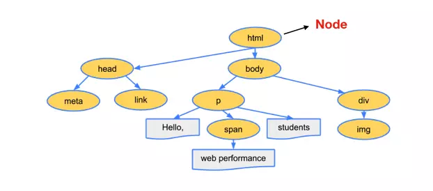

# 1 浏览器知识总结03

## 1.1 浏览器渲染原理

> 在浏览器中，执行JavaScript有JS引擎，那么执行渲染有渲染引擎（Rendering Engine）,但我们一般称之为浏览器内核。

### 1.1.1 浏览器渲染的过程

1. 浏览器将获取到的HTML文档解析成DOM（Document Object Model）树。
2. 处理CSS标记，构成层叠样式表模型CSSOM（CSS Object Model）。
3. 将DOM和CSSOM合并成渲染树（Redering Tree，代表一系列将被渲染的对象）。
4. 渲染树的每个元素包含的内容都是经过计算的，它被称为布局（layout）。浏览器使用一种流式处理的方法，只需要一次Pass绘制操作就能布局所有的元素。
5. 将渲染树的各个节点绘制到屏幕上，这一步称为Painting。

### 1.1.2 浏览器接收到 HTML 文件并转换为 DOM 树

> 当我们打开一个网页时，浏览器都会去请求对应的HTML文件。

1. HTML文档进行网络传输的时候实际的内容是0/1字节数据，所以，第一步需要将这些**字节数据转换成字符串**，也就是我们写的代码。

```js
字节数据（0/1）=》 字符串
```

2. 当数据被转换成字符串之后，浏览器会**将这些字符串通过词法分析转换成标记（Token)**，这一步在词法分析中叫做标记化（Tokenization）。

```js
字节数据（0/1）=》 字符串 =》 标记
```


3. 结束标记后，这些**标记会转换成Node**,最后这些**Node会根据不同的联系构成一个DOM数**。

```js
字节数据（0/1）=》 字符串 =》 标记 => Node => DOM
```

