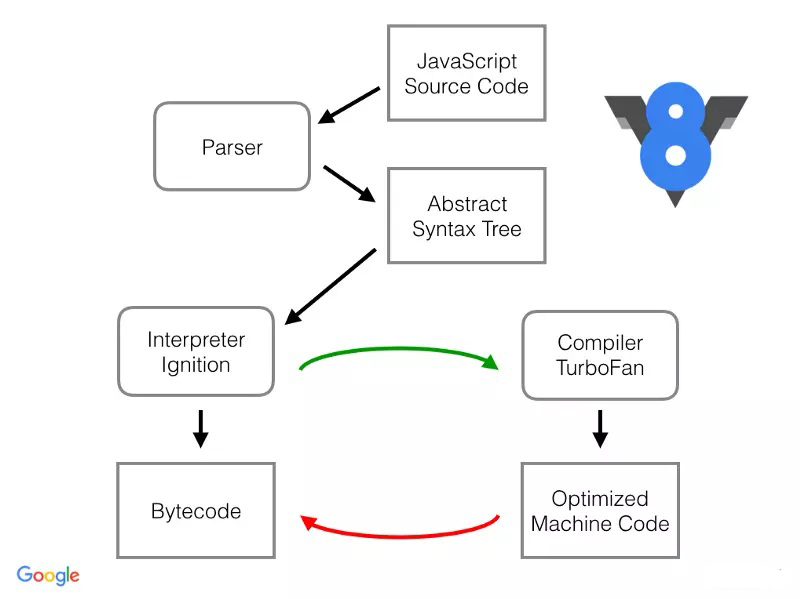

# 1 浏览器知识总结04

## 1.1 性能优化相关

### 1.1.1 V8引擎解析过程



1. JavaScript源码 =》 解析器 =》 抽象语法树 =》 解释程序 =》Bytecode
2. JavaScript源码 =》 解析器 =》 抽象语法树 =》 解释程序 => TurboFan编译器 =》 Optimized Machine Code =》Bytecode

- 从上图中我们可以发现，JS 会首先被解析为 AST，**解析的过程其实是略慢的**。代码越多，解析的过程也就耗费越长，这也是我们**需要压缩代码的原因**之一。

- 另外一种减少解析时间的方式是预解析，会作用于未执行的函数。

- 对于函数来说，应该尽可能避免声明嵌套函数（类也是函数），因为这样会造成函数的重复解析。

```js
function test1() {
  // 会被重复解析
  function test2() {}
}
```

- 然后 Ignition 负责将 AST 转化为 Bytecode，TurboFan 负责编译出优化后的 Machine Code，并且 Machine Code 在执行效率上优于 Bytecode。

#### 1.1.1.1 什么时候编译为Machine Code

1. JS 是一门动态类型的语言，并且还有一大堆的规则。简单的加法运算代码，内部就需要考虑好几种规则，比如数字相加、字符串相加、对象和字符串相加等等。这样的情况也就势必导致了内部要增加很多判断逻辑，降低运行效率。

```js
function sum(x) {
  return x + x;
}
sum(1);
sum(2);
sum(3);
sum(4);
```

- 对于以上代码来说，如果一个函数被多次调用并且参数一直传入 number 类型，那么 V8 就会认为该段代码可以编译为 Machine Code，因为你固定了类型，不需要再执行很多判断逻辑了。但是如果一旦我们传入的参数类型改变，那么 Machine Code 就会被 DeOptimized 为 Bytecode，这样就有性能上的一个损耗了。所以如果我们希望代码能多的编译为 Machine Code 并且 DeOptimized 的次数减少，就应该尽可能保证传入的类型一致。

#### 1.1.1.2 预编译

- 编译器还有个骚操作 Lazy-Compile，当函数没有被执行的时候，会对函数进行一次预解析，直到代码被执行以后才会被解析编译。对于上述代码来说，test 函数需要被预解析一次，然后在调用的时候再被解析编译。但是对于这种函数马上就被调用的情况来说，预解析这个过程其实是多余的，那么有什么办法能够让代码不被预解析呢？其实很简单，我们只需要给函数套上括号就可以了。

```js
(function sum(x) {
  return x + x
})
```

- 没办法给所有的函数加括号，解决方案：[optimize-js](https://github.com/nolanlawson/optimize-js)

### 1.1.2 图片优化

