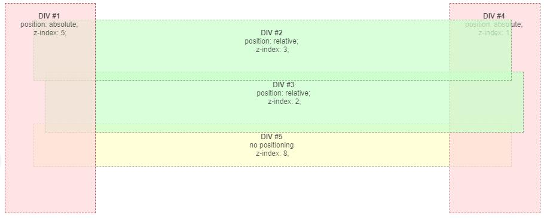
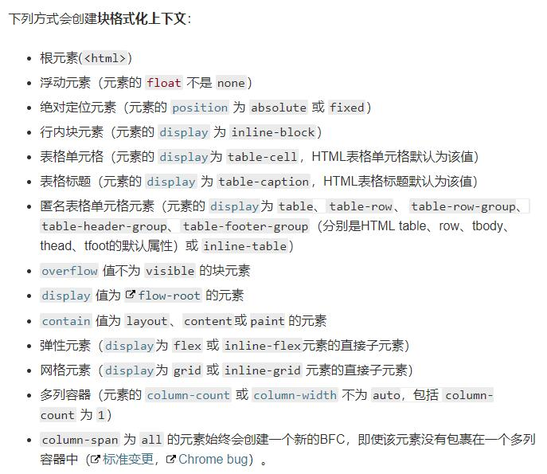
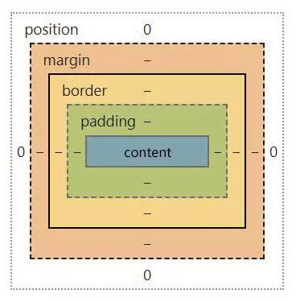
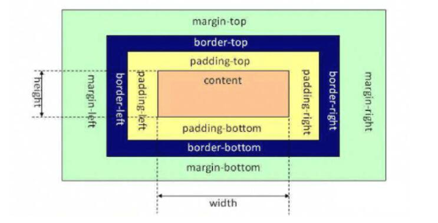
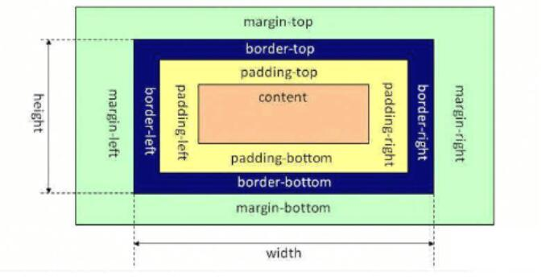

# CSS知识总结

## 1.1 link和@import的区别？

```html
1. link属于HTML标签，但是@import是CSS提供的。
2. 页面加载时，link会被同时加载，而@import引用的CSS要等到页面加载完毕之后再加载。
3. link没有兼容性问题，@import需在IE5以上才能识别。
4. link的权重大于@import。
5. 使用JavaScript控制DOM改变样式的时候，只能使用link标签，因为@import不受DOM控制。
```

## 1.2 隐藏页面元素的方式？

```html
1. opacity: 0;依旧占据空间且可以交互。
2. visibility: hidden;占据空间不可以交互。
3. overflow: hidden;只隐藏溢出部分，占据空间不可以交互。
4. display: none;不占空间不可交互。
5. z-index: -9999;将层级放到底层，占据空间。
6. transform: scale(0, 0);将元素缩小为0。
```

## 1.3 如何理解z-index？

```html
1. CSS的z-index属性控制重叠属性的垂直叠加顺序，默认元素的z-index为0。
2. z-index只适用于设置了position值的元素（默认为0）。
```



```html
1. 如上图，没有设置position值，但设置z-index是无效的。
2. z-index的值越大，垂直叠加越靠上。
```

## 1.4 BFC

### 1.4.1 什么是BFC

> BFC(Block Formatting Context)直译为块级格式化上下文。它是独立的一块渲染区域，只有block-level box参与，它规定了内部的block-level box如何布局，并且这个区域与外部毫无关系。

### 1.4.2  BFC约束条件

```html
1. 属于同一个BFC的相邻两个box的margin会发生重叠（塌陷），与方向无关。
2. BFC区域不会和float元素重叠。
3. 计算BFC高度时，float元素也参与计算（清除浮动）。
4. BFC就是页面上一个隔离的独立容器，容器里面的子元素不会影响到外面元素，反之依然。
```

### 1.4.3 应用

#### 1.4.3.1 防止margin重叠（塌陷）

```html
1. 垂直方向
<style>
.bfc-box {
  overflow: hidden; // 一个新的BFC
}
p {
  margin: 10px;
}
</style>
<div class="wrapper">
  <p></p>
  <div class="bfc-box">
    <p></p>
  </div>
</div>

2. 水平方向
<style>
.bfc-box {
  writting-mode: tb-rl;
}
p {
  margin: 10px;
  overflow: hidden; // 每个p标签一个新的BFC，各个空间互不干涉
}
</style>
<div class="bfc-box">
  <p></p>
  <p></p>
</div>
```

#### 1.4.3.2 清除浮动

```html
<style>
.bfc-box {
  overflow: hidden; // 新的BFC，能撑开高度
}
.float-box {
  width: 100%;
  height: 200px;
}
</style>
<div class="bfc-box">
  <div class="float-box"></div>
</div>
```

#### 1.4.3.3 自适应多栏布局

```html
<style>
.bfc-box {
  width: 300px;
  position: relative;
}
.right {
  width: 100px;
  float: left;
}
.left {
  overflow: hidden; // BFC区域不会与float元素重叠
}
</style>
<div class="bfc-box">
  <div class="right"></div>
  <div class="left"></div>
</div>
```

### 1.4.4 BFC产生条件



## 1.5 盒模型的理解



> 盒模型由content(内容)，padding(内边距)，border(边框)，margin(外边距)组成。

### 1.5.1 标准盒模型和怪异盒模型有什么差异

#### 1.5.1.1 标准盒子



> 标准盒子中：width = content-width;height = content-height;

```html
elemet-width = margin-left+border-left+padding-left+width+padding-right+border-right+margin-right

element-height = margin-top+border-top+padding-top+height+padding-bottom+border-bottom+margin-bottom
```

#### 1.5.1.2 怪异盒子



> 怪异盒子中：width = border-left + padding-left + content-width + padding-right + border-right;height = border-top + padding-top + content-height + padding-bottom + border-bottom;

```html
element-width = margin-left + width + margin-right

element-height = margin-top + height + margin-bottom
```

#### 1.5.1.3 其他

由于有的时候IE的怪异盒子模型很好用，所以W3C在CSS3中加入了box-sizing。

```js
box-sizing: content-box; // 标准盒模型
box-sizing: border-box; // 怪异盒模型
box-sizing: padding-box; // 火狐私有模型，无人使用
```

## 1.6 flex

[flex语法](http://www.ruanyifeng.com/blog/2015/07/flex-grammar.html)