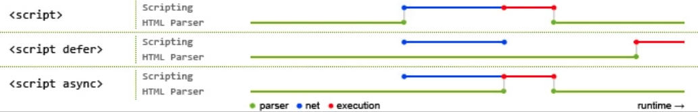

# HTML知识总结

## 1.1 doctype的作用是什么？

```text
DOCTYPE必须声明再html文档的第一行，告诉浏览器解析器使用什么文档标准解析。
由于html5不再给予SGML，所以DOCTYPE不用在制定DTD。

<!DOCTYPE html> // HTML5
<!DOCTYPE HTML PUBLIC "-//W3C//DTD ...> // <5
```

## 1.2 什么是data-属性？

```js
// HTML的数据属性，用于将数据存储在标准HTML元素中并通过js访问。 ele.dataset.property


let original = document.querySelector(".original-img").dataset.original; // xx/xx.png
```

## 1.3 script标签中defer和async的区别？

```text
script标签默认是同步加载的，当文档加载script标签，html解析暂停等待，等待script加载执行完毕继续解析html。

script加上defer/async后异步加载。
defer: 等待html文档完全解析完成（script被异步加载后不会立即执行），执行加载好的script
async: 不会等待HTML文档完全加载完毕，会立即执行。
```



## 1.4 有几种前端储存的方式？

```text
cookie/session/localStorage/sessionStorage/indexedDB

1. cookie: html5标准前主要本地储存方式，优点是兼容性好，请求头自带cookie方便。但是cookie很小（4k），自动请求头加cookie浪费流量等。
2. session: session会话机制是一种服务器端机制.
3. localStorage: 本地持久化存储。
4. sessionStorage: 本地会话性存储。
5. indexedDB: 是被正式纳入HTML5标准的数据库储存方案，它是NoSQL数据库，用键值对进行储存，可以进行快速读取操作，非常适合web场景，同时用JavaScript进行操作会非常方便。
```