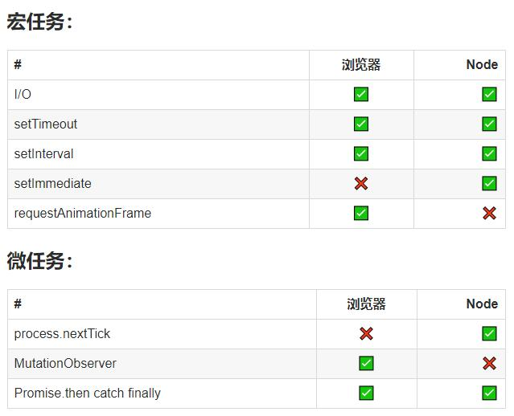

# JavaScript知识总结

## 1.1 JavaScript执行机制

> 首先，我们我们知道JavaScript是一门单线程语言，是按照语句出现的顺序执行的。

### 1.1.1 遇到的问题

```js
// 这个时候的运行顺序就不太一样了
setTimeout(() => {
  console.log("程序运行开始了");
}, 0);

new Promise((resolve) => {
  const str = "执行resolve函数了";
  console.log(str);
  resolve(str)
}).then(() => {
  console.log("执行then函数了")
})

console.log("代码结束了");

// 执行resolve函数了
// 代码结束了
// 执行then函数了
// 程序运行开始了
```

### 1.1.2 JavaScript事件循环

> 无论怎样，JavaScript都是一门单线程的语言，所以JavaScript的多线程都是模拟出来的。但是如果一个任务过于耗时，JavaScript的处理方式是啥呢？


1. 同步和异步任务分别进入不同的执行"场所"，同步的进入主线程，异步的进入Event Table并注册函数。
2. 当指定的事情完成时，Event Table会将这个函数移入Event Queue。
3. 主线程内的任务执行完毕为空，会去Event Queue读取对应的函数，进入主线程执行。
4. 上述过程会不断重复，也就是常说的Event Loop(事件循环)。

### 1.1.3 宏任务/微任务

> 代码开始执行时，首先执行推入主线程的同步任务。然后遇到对应的异步任务被归类到宏任务队列和微任务队列中。所以执行顺序为：同步任务 -> 微任务队列 -> 宏任务队列。




### 1.1.4 练习

[梯子](https://www.cnblogs.com/intangible/p/8066979.html)

## 1.2 闭包

### 1.2.1 什么是闭包

> MDN：闭包是函数和声明该函数的词法环境的组合。

```js
function func() { //声明该函数的词法环境
  let a = "test";
  return function() { // 函数（闭包）
    return a; // 使用词法环境中的变量
  }
}
```

### 1.2.2 闭包的作用

> 隐藏变量。

- 闭包的一大特性时内部函数总是能够访问其所在词法环境中的变量和参数，即使在外部函数别返回（销毁）之后。

- 由于以上的原因，为了防止内存泄漏，所以一般在闭包使用结束需要手动销毁。

- 闭包可以实现私有变量、特权变量、储存变量等。

```js
function Person() {
  let name = "Robin";
  this.setName = function(val) {
    name = val;
  };
  this.getName = function() {
    return name;
  }
}

let person = new Person();
console.log(person.getName()); // Robin
person.setName("cHeNg5");
console.log(person.getName()); // cHeNg5
console.log(name); // name is not defined,私有变量外部无法访问
```
