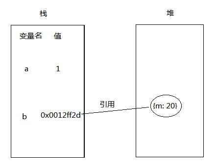
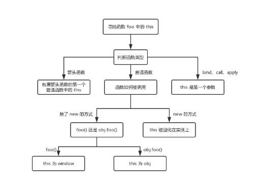

# JavaScript基础知识

## 1.1 数据类型

> JavaScript的数据类型可以分为原始数据类型（Primitive）和引用（Object）数据类型。

### 1.1.1 原始（primitive）数据类型

JavaScript中，包含6中原始值，分别是：

- number

- string

- boolean

- null

- undefined

- symbol

**NOTE1：原始值存储的都是值，是没有函数可以调用的。**

**NOTE2：虽然typeof null -> object，但它并不是对象数据类型。**

**NOTE3：JS的number是浮点型的，所以0.1 + 0.2 !== 0.3，但是string类型的值不会改变。**

```js
null.toString(); // Cannot read property "toString" of null

"1".toString(); // 1 => 此时“1”已经不是原始数据类型，已经被强制转换成String类型（对象数据类型）
```

### 1.1.2 引用数据类型（对象数据类型）

> JavaScript中，除了原始数据类型，其他的就都是引用数据类型了。原始数据类型和引用数据类型的不同是，原始数据类型存储的是值，引用数据类型存储的是指针。



- 栈：遵循的是后进先出的原则，属于一级缓存，由编译器自动分配释放，读写快，存储的都是固定值（原始数据类型）。

- 堆：数据二级缓存，有调用者分配释放，若没有手动释放，可能由GC回后，存储的都是以后用类型。

**NOTE：这就很好理解深浅复制，浅复制复制的是引用地址，但是地址指向的内容是一样的，所以任意一个实例改变了应用的值，其他的也会改变。而深复制则是完全拷贝了一份新的，新的引用地址，新的引用。**

```js
function test(person) {
  person.age = 26
  person = {
    name: 'yyy',
    age: 30
  }

  return person
}
const p1 = {
  name: 'yck',
  age: 25
}
const p2 = test(p1) // 开辟新的内存空间
console.log(p1) // {name: "yck", age: 26}
console.log(p2) // {name: "yyy", age: 30}
```

### 1.1.3 typeof和instanceof

#### 1.1.3.1 typeof

> typeof 是一个一元运算，放在一个运算数之前，运算数可以是任意类型。它返回值是一个字符串，该字符串说明运算数的类型。可能的结果："number"、"string"、"boolean"、"symbol"、"object"、"function" 和 "undefined"。

**NOTE：typeof null会返回object，这是一个bug。**

```js
typeof 1 // 'number'
typeof '1' // 'string'
typeof undefined // 'undefined'
typeof true // 'boolean'
typeof Symbol() // 'symbol'
typeof console.log // 'function'
typeof [] // 'object'
```

##### 1.1.3.1.1 typeof的使用

```js
// 判断一个变量是否存在，如未定义返回“undefined”
if (typeof a !== "undefined") {
  // TODO
}
if (typeof(aList.length) !== "undefined") {
  // TODO
}
```

#### 1.1.3.2 instanceof

typeof的局限性在于只要参数是引用类型，返回的都是“object”,instaceof可以用来判断该对象是否是另一个对象的实例。

> instanceof 运算符用来测试一个对象在其原型链中是否存在一个构造函数的 prototype 属性。语法：object instanceof constructor。

**instanceof 运算符用来检测 constructor.prototype 是否存在于参数 object 的原型链上。**

```js
let a = new Array();
a instanceof Array; // true
a instanceof Object; // true
```

```js
// 判断子类是否继承自父类
function Sup() {}
function Sub() {
  Sup.call(this);
}
Sub.prototype = Object.create(Sup.prototype);
Sub.prototype.constructor = Sub;
let sub = new Sub();
sub instanceof Sup; // true
```

### 1.1.4 this

> this 既不指向函数自身，也不指函数的词法作用域，它是在函数被调用时才会被绑定，也就是说this具体指向什么，取决于怎么调用函数。

```js
function foo() {
  console.log(this.a)
}
var a = 1
foo() // window

const obj = {
  a: 2,
  foo: foo
}
obj.foo() // obj

const c = new foo() // foo()
```

#### 1.1.4.1 箭头函数中的this

> 箭头函数中没有this这一个说法，箭头函数的this取决于包裹箭头函数的第一个普通函数中的this。

```js
function a() {
  return () => {
    return () => {
      console.log(this);
    }
  }
}
console.log(a()()());  // Window
```

```js
// 无论bind绑定多少次，只由第一次决定
// 第一次为window
let a = {}
let fn = function () { console.log(this) }
fn.bind().bind(a)() // window
// 第一次为a
let a = { name: 'yck' }
function foo() {
  console.log(this.name)
}
foo.bind(a)() // yck
```



