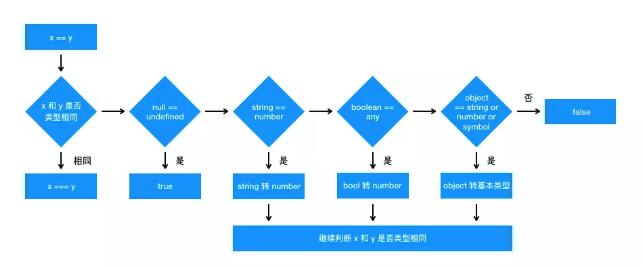

# JavaScript基础知识

## 2.1 ==与===

> ==比对的是值，===比对的是值和类型。==在比对之前如果类型不同会进行类型转换。

### 2.1.1 ==的判断流程

```js
1. 首先判断两者的类型是否相同，相同进行===比较。
// 类型不同时，会进行类型转换
2. 如果一个为null，一个为undefined，返回true。
3. 如果一个为字符串，一个数值，那么在比较之前调用Number()函数将字符串转换成数值。
4. 如果任一值值布尔值，则在比较之前调用Number()函数先转换成数值。
5. 如果一个是对象，另一个是数值或者字符串，先将其转换成基础类型的值在比较。
```



### 2.1.2 练习

```js
// [] == []
1. 两者类型相同，则进行===比较。
2. []的地址与[]的地址不同，故返回false。

// [] == ![]
1. ![] -> false
2. 触发条件4，Number(false) -> 0。
3. 触发条件5，[].toString() -> ""。
4. 触发条件3，Number("") -> 0。
5. 0 == 0，返回true。
```

### 2.1.3 ===

> 严格比较，值和类型都必须相同。

## 2.2 深浅拷贝

### 2.2.1 浅拷贝

> 浅拷贝只复制指向某个对象的指针，而不复制对象本身，新旧对象还是共享同一块内存。

```js
let obj = {
  a: 2
};
let objCopy = obj;
objCopy.a = 3;
console.log(obj.a); // 3

// 对象与复制的对象共享一块内存，无论谁改变，都会影响值。
```


### 2.2.2 深拷贝

> 深拷贝是拷贝一个一模一样的对象，并新开辟内存空间存储，不共享内存，独立存在。

```js
let obj = {
  a: 2
};
let objCopy = JSON.parse(JSON.stringify(obj));
objCopy.a = 3;
console.log(obj.a); // 2

// objCopy始新开辟的内存空间，他的指针不指向obj的指针地址。
```

### 2.2.3 实现