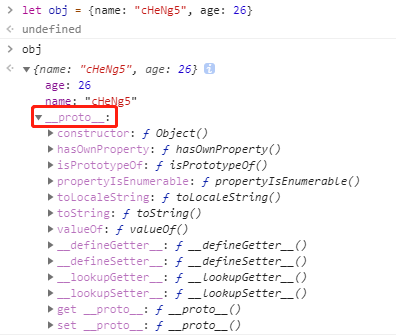

# JavaScript基础知识

## 2.1 ==与===

> ==比对的是值，===比对的是值和类型。==在比对之前如果类型不同会进行类型转换。

### 2.1.1 ==的判断流程

```js
1. 首先判断两者的类型是否相同，相同进行===比较。
// 类型不同时，会进行类型转换
2. 如果一个为null，一个为undefined，返回true。
3. 如果一个为字符串，一个数值，那么在比较之前调用Number()函数将字符串转换成数值。
4. 如果任一值值布尔值，则在比较之前调用Number()函数先转换成数值。
5. 如果一个是对象，另一个是数值或者字符串，先将其转换成基础类型的值在比较。
```


### 2.1.2 练习

```js
// [] == []
1. 两者类型相同，则进行===比较。
2. []的地址与[]的地址不同，故返回false。

// [] == ![]
1. ![] -> false
2. 触发条件4，Number(false) -> 0。
3. 触发条件5，[].toString() -> ""。
4. 触发条件3，Number("") -> 0。
5. 0 == 0，返回true。
```

### 2.1.3 ===

> 严格比较，值和类型都必须相同。

## 2.2 深浅拷贝

### 2.2.1 浅拷贝

> 浅拷贝只复制指向某个对象的指针，而不复制对象本身，新旧对象还是共享同一块内存。

```js
let obj = {
  a: 2
};
let objCopy = obj;
objCopy.a = 3;
console.log(obj.a); // 3

// 对象与复制的对象共享一块内存，无论谁改变，都会影响值。
```


### 2.2.2 深拷贝

> 深拷贝是拷贝一个一模一样的对象，并新开辟内存空间存储，不共享内存，独立存在。

```js
let obj = {
  a: 2
};
let objCopy = JSON.parse(JSON.stringify(obj));
objCopy.a = 3;
console.log(obj.a); // 2

// objCopy始新开辟的内存空间，他的指针不指向obj的指针地址。
```


### 2.2.3 实现

#### 2.2.3.1 浅拷贝实现

```js
function shallowCopy(obj) {
  let shallowObj = {};
  for (let key in obj) {
    if (obj.hasOwnProperty(key)) shallowObj[key] = obj[key];
  }
  return shallowObj;
}
```

#### 2.2.3.2 深拷贝实现

```js
// 如果没有特殊的数据解构
JSON.parse(JSON.stringify(obj));

// 缺点：
// 1. 会忽略undefined
// 2. 会忽略symbol
// 3. 不能序列化函数
// 4. 不能解决循环引用的对象

let a = {
  age: undefined,
  sex: Symbol("male"),
  jobs: function() {},
  name: "cHeNg5"
}
let b = JSON.parse(JSON.stringify(a))
console.log(b) // {name: "cHeNg5"} => 引发上述问题
```

```js
// 自己实现气来还是很困难的，有很多的边界需要处理,推荐：
Lodash.js

let deepObj = [{"a": 1}, {"b": 2}];
let deepCopy = _.cloneDeep(deepObj);
console.log(deepObj[0] === deepCopy[0]); // false => 深拷贝
```

## 2.3 原型

### 2.3.1 普通对象和函数对象

> 通过new Function()创建的对象都是函数对象，其他的额就是普通对象。

```js
let f1 = new Function();
let f2 = function() {};
function f3() {};

let o1 = {};
let o2 = new Object();
let o3 = new f3();

console.log(typeof f1/f2/f3); // function
console.log(typeof o1/o2/o3); // object
```

### 2.3.2 原型



```js
function Person() {}

let person = new Person();
```

- 虽然不推荐直接使用，每个对象都有__proto__属性，他指向原型对象。

- person.\__proto__ —> Person.prototype

> 原型其实也是一个对象，它包含了很多的函数。所以我们可以通过__proto__找到一个原型对象。

**原型链通过__proto__链接**

- 一个原型对象的constructor属性指向构造函数。Person.prototype.constructor = Person。


### 2.3.3 总结

1. Object 是所有对象的爸爸，所有对象都可以通过 \__proto__ 找到它
2. Function 是所有函数的爸爸，所有函数都可以通过 \__proto__ 找到它
3. 函数的 prototype 是一个对象
4. 对象的 \__proto__ 属性指向原型， \__proto__ 将对象和原型连接起来组成了原型链

## 2.4 Object.defineProperty()与Proxy

> Object.defineProperty与ES2015新增的Proxy对象，都会被用来做数据劫持。

- 数据劫持：在访问或者修改对象某个属性时，通过一段代码拦截找个行为，进行额外的操作或者修改返回结果。

### 2.4.1 Object.defineProperty()

> Object.defineProperty()方法直接在一个对象上定义一个新属性，或者修改一个对象的现有属性，并返回这个对象。

```js
Object.defineProperty(obj, prop, descriptor)

params:
1. obj => 要在其上定义属性的对象
2. prop => 要定义或者修改属性的名称
3. descriptor => 将被定义或者修改属性描述符。

return:
被传递给函数的对象。

一般通过为对象的属性赋值的情况下，对象的属性可以修改也可以删除，但是通过Object.defineProperty()定义属性，通过描述符的设置可以进行更精准的控制对象属性。
```


#### 2.4.1.1 descriptor描述符

##### 2.4.1.1.1 数据描述符（value/writable)

```js
let Person = {};
// 1.默认方式
Object.defineProperty(Person, "name", {
  value: "Robin"
});
Person.name = "cHeNg5";
console.log(Person.name); // Robin =》 writable默认是false,不能改变属性的值。

// 2. 可重写
Object.defineProperty(Person, "name", {
  value: "Robin",
  writable: true
});
Person.name = "cHeNg5";
console.log(Person.name); // cHeNg5
```

##### 2.4.1.1.2 存取描述符（getter/setter）

```js
let Person = {};
let tempt = null;
Object.defineProperty(Person, "name", {
  get: function() {
    return tempt;
  },
  set: function(val) {
    tempt = val;
  }
});
Person.name = "Robin"; // set操作
console.log(Person.name); // get操作
```

##### 2.4.1.1.3 数据描述符和存取描述符都具有的描述符

1. configurable：描述属性是否可配置，可删除。
2. enumerable：描述属性是否可出现在for-in或者Object.keys()的遍历中。

```js
// 不可删除
let Person = {};
Object.defineProperty(Person, "name", {
  value: "Robin",
  configurable: false
});
delete Person.name; // Error: Cannot delete property "name" of #<Object>

// 不可redefine
Object.defineProperty(Person, "name", {
  value: "cHeNg5"
}); // Error: Cannot redefine property: name

// 当同时设置writable时
let Name = {};
Object.defineProperty(Name, "name", {
  value: "cHeNg5",
  configurable: false,
  writable: true
});
Object.defineProperty(Name, "name", {
  value: "Robin"
}); // 由于writable的原因，redefine不会报错
Name.name = "superFatDu";
console.log(Name.name); // superFatDu
```

1. configurable: false 时，不能删除当前属性，且不能重新配置当前属性的描述符(有一个小小的意外：可以把writable的状态由true改为false,但是无法由false改为true),但是在writable: true的情况下，可以改变value的值

### 2.4.2 Proxy

[Proxy梯子](https://github.com/superFatDu/front-end-arrangement/blob/master/zfpx/ES6/Proxy.js)

[proxy&reflect](https://segmentfault.com/a/1190000015581013)

### 2.4.1 Reflect

## 2.5 map&filer&reduce

### 2.5.1 map

```js
let arr = [1, 2, 3];
let temptArr = arr.map(item => {
  return item + 1
});
console.log(temptArr); // [2, 3, 4]
```

### 2.5.2 filter

```js
let arr = [1, 3, 4, 4, 5];
let temptArr = arr.filter(item => {
  return item !== 4;
})
console.log(temptArr); // [1, 3, 5]
```

### 2.5.3 reduce

```js
let arr = [{price: 1}, {price: 2}, {price: 3}];
let sumArr = arr.reduce((prev, next) => {
  return prev + next.price;
}, 0)
console.log(sumArr); // 6
```
