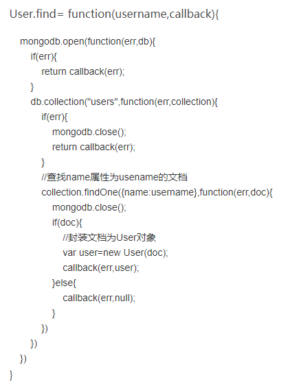

# JavaScript知识总结

## 1.1 JavaScript执行机制

> 首先，我们我们知道JavaScript是一门单线程语言，是按照语句出现的顺序执行的。

### 1.1.1 遇到的问题

```js
// 这个时候的运行顺序就不太一样了
setTimeout(() => {
  console.log("程序运行开始了");
}, 0);

new Promise((resolve) => {
  const str = "执行resolve函数了";
  console.log(str);
  resolve(str)
}).then(() => {
  console.log("执行then函数了")
})

console.log("代码结束了");

// 执行resolve函数了
// 代码结束了
// 执行then函数了
// 程序运行开始了
```

### 1.1.2 JavaScript事件循环

> 无论怎样，JavaScript都是一门单线程的语言，所以JavaScript的多线程都是模拟出来的。但是如果一个任务过于耗时，JavaScript的处理方式是啥呢？


1. 同步和异步任务分别进入不同的执行"场所"，同步的进入主线程，异步的进入Event Table并注册函数。
2. 当指定的事情完成时，Event Table会将这个函数移入Event Queue。
3. 主线程内的任务执行完毕为空，会去Event Queue读取对应的函数，进入主线程执行。
4. 上述过程会不断重复，也就是常说的Event Loop(事件循环)。

### 1.1.3 宏任务/微任务

> 代码开始执行时，首先执行推入主线程的同步任务。然后遇到对应的异步任务被归类到宏任务队列和微任务队列中。所以执行顺序为：同步任务 -> 微任务队列 -> 宏任务队列。


### 1.1.4 练习

[梯子](https://www.cnblogs.com/intangible/p/8066979.html)

## 1.2 闭包

### 1.2.1 什么是闭包

> MDN：闭包是函数和声明该函数的词法环境的组合。

```js
function func() { //声明该函数的词法环境
  let a = "test";
  return function() { // 函数（闭包）
    return a; // 使用词法环境中的变量
  }
}
```

### 1.2.2 闭包的作用

> 隐藏变量。

- 闭包的一大特性时内部函数总是能够访问其所在词法环境中的变量和参数，即使在外部函数别返回（销毁）之后。

- 由于以上的原因，为了防止内存泄漏，所以一般在闭包使用结束需要手动销毁。

- 闭包可以实现私有变量、特权变量、储存变量等。

```js
function Person() {
  let name = "Robin";
  this.setName = function(val) {
    name = val;
  };
  this.getName = function() {
    return name;
  }
}

let person = new Person();
console.log(person.getName()); // Robin
person.setName("cHeNg5");
console.log(person.getName()); // cHeNg5
console.log(name); // name is not defined,私有变量外部无法访问
```

## 1.3 JavaScript的作用域链

> JavaScript属于静态作用域，即声明的作用域是根据程序正文在编译时就确定的，有时也称为词法作用域。


- 其本质是JavaScript在执行过程中会创造可执行上下文，可执行上下文中的词法环境中含有外部词法环境的引用，我们可以通过这个引用获取外部词法环境的变量、声明等，这些引用串联起来一直指向全局的词法环境，因此形成了作用域链。

```js
let obj = { // Global Exection Context
  let 0bj1 = 1;
  subContext: function() { // ExectionContext1
    let _this = this;
    let obj2 = 2;
    return function() { // ExectionContext2
      return _this.subObj1 + obj2;
    }
  }
}

// ExectionContext2引用了ExectionContext1和GlobalExectionContext的变量。所以ExectionContext2 -> ExectionContext2 -> GlobalExectionContext组成了一条作用域链。
```

## 1.4 判断是否是数组

```js
// ES6
if（Array.isArray(value)）{
    return true;
}

// 兼容性处理
if（!Array.isArray）{
  Array.isArray = function(arg) {
    return Object.prototype.toString.call(arg) === "[object Array]";
  }
}
```

## 1.5 并行与并发

- 并行与并发的相同之处在于并，也就是处理多个任务的能力。这也是并行与并发的先决条件。

```js
// 一个例子
1. 吃饭的时候，电话来了，你需要一直等到饭吃完了才能接电话，说明不支持并行和并发。
2. 吃饭的时候，电话来了，你可以先接电话然后继续吃饭，说明支持并发。
3. 吃饭的时候，电话来了，你可以边吃饭边接电话，说明支持并行。
```

1. 并发是有同时处理多个任务的能力，但是不一定同时。（**轮流处理**）
2. 并行是能同时处理多个任务，关键是同时。（**同时处理**）

## 1.6 回调函数

```js
// 1. 方式1
function say(value) {
  alert(value);
}
function execute(someFunction, value) {
  someFunction(value);
}
execute(say, "say hi");

// 方式2
execute(value => alert(value), "say hi");
```


> A callback is a function that is passed as an argument to another function and is executed after its parent function has completed。

### 1.6.1 示例




## 1.7 Generator

### 1.7.1 关于Generator

> generator是ES6标准新引入的一种数据类型。一个generator看上去像一个函数，但是可以有多个返回。

- 函数执行过程中，如果没有遇到return语句（函数末尾没有return，就是隐含的return undefined），控制权无法交会被调用的函数。

```js
function noReturn() {} => // 隐含return undefined
console.log(noReturn()); // undefined
```

> generator和函数不同的是，generator是由function\*定义，由functio\*定义，由function\*定义，并且出来return语句，还可以用yield返回多次。

```js
function* exampleYield(x) {
  yield x + 1;
  yield x + 2;
  return x + 3;
}
console.log(exampleYield(1)); // Object [Generator] {}
```

- 用函数的方式调用generator指挥返回一个Object，因为这只是创建了一generator的对象，还没有真正的执行它。
- 调用generator对象有两个方法，一个是一次次地调用next()方法，另一个是for-of迭代generator对象。

```js
let eY = exampleYield(1);
// 1. 方式一
eY.next(); // {value: 2, done: false}
eY.next(); // {value: 3, done: false}
eY.next(); // {value: 4, done: true}
eY.next(); // {value: undefined, done: true}

// 2. 方式二
for(let x of eY) {
  console.log(x); // 2 3
}
```

- 因为generator可以在执行的过程中多次返回，所以它看上去就像一个可以记住执行状态的函数。如果传参，那么传入的参数等于上一个yield的返回值。

```js
function *foo(x) {
  let y = 2 * (yield (x + 1))
  let z = yield (y / 3)
  return (x + y + z)
}
let it = foo(5)
console.log(it.next())   // => {value: 6, done: false}
console.log(it.next(12)) // => {value: 8, done: false}
console.log(it.next(13)) // => {value: 42, done: true}

//1. 当执行第一个next()时，参数会被忽略，并且函数会暂停在yield（x + 1）出，所以返回5 + 1 = 6；

//2. 当执行第二个next()时，传入的参数等于上衣个yield的返回值，所以y = 2 * 12;这一次函数会停留在yield（y / 3）= 24 / 3 = 8；

//3. 当执行第三个next()时，传入的参数等于上一个yield的返回值，所以z = 13，所以return的返回值等于5 + 24 + 13 = 42
```

### 1.7.2解决问题

```js
// 解决回调地狱
function* fetch() {
  yield ajax(url, () => {});
  yield ajax(url, () => {});
  yield ajax(url, () => {});
}
let it = fetch();
let result1 = it.next();
let result2 = it.next();
let result3 = it.next();
```

- 看上去代码是同步的，实际执行是异步的。

## 1.8 Promise

> The Promise object represents the eventual completion(or failure) of an asynchronous operation, and its resulting value.（Promise对象用于表示一个异步操作的最终完成（或失败），及其结果值。）

### 1.8.1 语法

```js
/*
* Promise
* @params executor 带有resolve和reject两个参数的函数。
*/
new Promise(function(resolve, reject) {...} /* executor */)
```

### 1.8.2 引入

```js
let promise = new Promise((resolve, reject) => {
  setTimeout(() => {
    resolve('success');
  }, 300)
});
promise.then(res => {
  console.log(res); // success
});
console.log(promise); // [object Promise]
```

### 1.8.3 介绍

> Promise对象是一个代理对象（代理一个值），被代理的值在Promise对象创建时可能是未知的。它允许你为异步操作的成功和失败绑定响应的处理方法（handler =》 function(resolve, reject) {...}）。

#### 1.8.3.1 Promise状态

1. pending: 初始状态，既不是成功，也不是失败状态。
2. fulfilled: 意味着操作成功。
3. rejected: 意味着操作失败。


#### 1.8.3.2 方法

1. Promise.all(iterable)

> 返回一个 Promise 实例，此实例在 iterable 参数内所有的 promise 都“完成（resolved）”或参数中不包含 promise 时回调完成（resolve）；如果参数中  promise 有一个失败（rejected），此实例回调失败（reject），失败原因的是第一个失败 promise 的结果。

```js
/*
* @params iterable 一个可迭代对象，如Array或String。
* @return 1. 如果传入的参数是一个空的可迭代对象，则返回一个已完成（already resolved）状态的 Promise;
* @return 2. 如果传入的参数不包含任何 promise，则返回一个异步完成（asynchronously resolved） Promise。注意：Google Chrome 58 在这种情况下返回一个已完成（already resolved）状态的 Promise;
* @return 3. 其它情况下返回一个处理中（pending）的Promise。这个返回的 promise 之后会在所有的 promise 都完成或有一个 promise 失败时异步地变为完成或失败。
*/
let promise1 = Promise.resolve(3);
let promise2 = 42;
let promise3 = new Promise((resolve, reject) => {
  setTimeout(resolve, 100, 100);
});
Promise.all([promise1, promise2, promise3]).then(res => {
  console.log(res); // Array [3, 42, 100]
})
```

2. Promise.race(iterable) 

> 返回一个 promise，一旦迭代器中的某个promise解决或拒绝，返回的 promise就会解决或拒绝。

```js
var promise1 = new Promise(function(resolve, reject) {
    setTimeout(resolve, 500, 'one');
});

var promise2 = new Promise(function(resolve, reject) {
    setTimeout(resolve, 100, 'two');
});

Promise.race([promise1, promise2]).then(function(value) {
  console.log(value); // "two"
  // Both resolve, but promise2 is faster
});
```

3. Promise.resolve(value)

> 返回一个以给定值解析后的Promise 对象。

```js
/*
* @ param value 将被Promise解析的参数，可以是一个Promise对象，也可以是一个thenable。
*/
let promise = Promise.resolve(123);
promise.then(res => {
  console.log(res); // 123
})
```

4. Promise.reject(reason)

> 返回一个带有拒绝原因reason参数的Promise对象。

```js
/*
* @param reason 表示Promise被拒绝的原因。
* @return 一个给定原因的被拒绝的Promise。
*/
Promise.reject("Testing static reject").then(function(reason) {
  // 未被调用
}, function(reason) {
  console.log(reason); // "Testing static reject"
});
```

## 1.9 async&await

```js
async function asyncFunc() {
  await api.ajax(url, ...);
}
```

- 由async声明的方法是异步方法，在方法体中可以使用await关键字，等待async操作对象的promise返回。这个函数总是返回一个promise，如果代码中有return <非 promise>语句，JavaScript会自动把返回的这个value值包装成promise的resolve值。
- 声明方式如下：

```js
// 异步函数声明
async function asyncFunc() {}

// 异步函数表达式
const asyncFunc = async function() {}

// 异步函数定义
let obj = {async asyncFunc() {}}

// 异步箭头函数
let asyncFunc = async () => {}
```

### 1.9.1 async

```js
async function func() {
  return new Promise((resolve, reject) => {
    resolve('This is a example');
  })
}
func().then(res => {
  console.log(res); // This is a example.
});

async function func1() {
  return 'This would be packed as a promise';
}
func1().then(res => {
  console.log(res); // This would be packed as a promise.
})
```

- async的作用：

1. 使函数总是返回一个promise。
2. 允许在函数体中使用await。

### 1.9.2 await

1. await关键字可以让JavaScript等待，知道一个promise执行并返回结果，JavaScript才会继续向下执行。

> let value = await promise;

```js
async function func() {
  let promise = new Promise(resolve => {
    setTimeout(resolve, 2000, "done");
  });
  let result = await promise; // 直到promise返回一个resolve值才继续向下走
  console.log(result); // expected output: done
}
```

2. 要使用await，则必须是一个异步函数，函数前面必须有async关键字。
3. await是顺序执行的（注：Promise.all()是并行的）。

```js
// 顺序执行
async function executeFunc() {
  let result1 = await asyncFunc1();
  let result2 = await asyncFunc2();
}

// 并行顺序
async function executeFunc() {
  const [result1, result2] = await Promise.all([
    asyncFunc1(),
    asyncFunc2()
  ]);
}
```