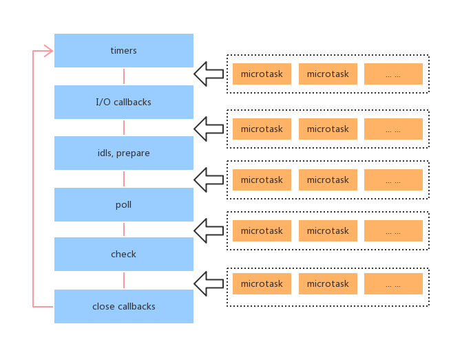

# JavaScript知识总结

## 1.1 Event Loop

### 1.1.1 进程和线程

> 这两个名词都是CPU工作时间片的一个描述。进程描述了CPU在运行指令及加载和保存上下文所需的时间，放在应用上来说就是一个程序。线程是进程中更小单位，描述了执行一段指令所需的时间。

- 比如打开一个浏览器的Tab页，这就是一个进程，一个进程可以包含多个线程，比如渲染线程，JS引擎线程，HTTP请求线程等等。（注：JS引擎线程运行时可能会阻塞UI渲染，所以JS引擎线程和渲染线程时互斥的。）

### 1.1.2 执行栈（execution stack）

> 可以把执行栈理解为一个存储函数调用的栈结构，遵循FILO(先进后出)。

```js
function foo(b) {
  var a = 5;
  return a * b + 10;
}
function bar(x) {
  var y = 3;
  return foo(x * y);
}
console.log(bar(6));
```


### 1.1.3 event loop

1. 同步和异步任务分别进入不同的执行"场所"，同步的进入主线程，异步的进入Event Table并注册函数。
2. 当指定的事情完成时，Event Table会将这个函数移入Event Queue。
3. 主线程内的任务执行完毕为空，会去Event Queue读取对应的函数，进入主线程执行。
4. 上述过程会不断重复，也就是常说的Event Loop(事件循环)。

**NOTE: 在 ES6 规范中，microtask 称为 jobs，macrotask 称为 task。**


### 1.1.4 Task Queue

> 见上一篇js_base_04.js。

```js
console.log('script start')

async function async1() {
  await async2()
  console.log('async1 end')
}
async function async2() {
  console.log('async2 end')
}
async1()

setTimeout(function() {
  console.log('setTimeout')
}, 0)

new Promise(resolve => {
  console.log('Promise')
  resolve()
})
  .then(function() {
    console.log('promise1')
  })
  .then(function() {
    console.log('promise2')
  })

console.log('script end')

// script start => async2 end => Promise => script end => promise1 => promise2 => async1 end => setTimeout
```

1. 首先先来解释下上述代码的 async 和 await 的执行顺序。当我们调用 async1 函数时，会马上输出 async2 end，并且函数返回一个 Promise，接下来在遇到 await的时候会就让出线程开始执行 async1 外的代码，所以我们完全可以把 await 看成是让出线程的标志。
2. 然后当同步代码全部执行完毕以后，就会去执行所有的异步代码，那么又会回到 await 的位置执行返回的 Promise 的 resolve 函数，这又会把 resolve 丢到微任务队列中，接下来去执行 then 中的回调，当两个 then 中的回调全部执行完毕以后，又会回到 await 的位置处理返回值，这时候你可以看成是 Promise.resolve(返回值).then()，然后 await 后的代码全部被包裹进了 then 的回调中，所以 console.log('async1 end') 会优先执行于 setTimeout。
3. **重点：await让出线程/Promise.then时微任务队列优先于setTimeout宏任务队列。**

**NOTE: 新的浏览器中的输出会不同，await快于微任务队列。**


### 1.1.4.1 总结

- 首先执行同步代码，这属于宏任务
- 当执行完所有同步代码后，执行栈为空，查询是否有异步代码需要执行
- 执行所有微任务
- 当执行完所有微任务后，如有必要会渲染页面
- 然后开始下一轮 Event Loop，执行宏任务中的异步代码，也就是 setTimeout 中的回调函数

1. 微任务：process.nextTick ，promise ，MutationObserver。
2. 宏任务：script ， setTimeout ，setInterval ，setImmediate ，I/O ，UI rendering。
3. **这里很多人会有个误区，认为微任务快于宏任务，其实是错误的。因为宏任务中包括了 script ，浏览器会先执行一个宏任务，接下来有异步代码的话才会先执行微任务。**

## 1.2 Node Event Loop

### 1.2.1 Node三大特点

> 1.单线程;2.非阻塞I/O(non-blocking I/0);3.事件驱动(event-driven)

#### 1.2.1.1 单线程

> 在Java/PHP等服务端语言中，会为每一个客户端连接创建一个新的线程（每个线程大约耗费2MB内存，理论上一个8GB内存的服务器可以同时连接4000个用户）；而Node不会为每个客户端连接创建一个新的线程，而仅仅使用一个线程，当有用户连接了，就触发一个内部事件，通过非阻塞I/O，事件驱动机制，让Node程序宏观上也是并发的（一个8GB内存的服务器，可以同时处理超过4万用户的连接）。

- 多线程和单线程


#### 1.2.1.2 非阻塞I/O(non-blocking I/O)

- 在传统的单线程处理机制中，在执行了访问数据库代码之后，整个线程都将暂停下来，等待数据库返回结果，然后才能执行后面的代码。**也就是说，I/O阻塞了代码的执行，降低了程序的执行效率。**

- Node解决方案：

1. Node采用了非阻塞I/O机制。因此在执行了访问数据的代码之后，将立即转而执行后面的代码，**把数据库的返回结果的处理代码放在回调函数中**，从而提高了程序的执行效率。
2. 当某个I/O执行完毕时，**将以事件的形式通知执行I/O操作的线程**，线程执行这个事件的**回调函数**。为了处理异步事件，线程必须有事件循环，不断地检查有没有未处理的事件，依次予以处理。
3. 非阻塞模式下，**一个线程永远在执行计算操作**，这个线程的CPU核心利用率永远是100%。

#### 1.2.1.3 事件驱动(event-driven)

> 在Node中，客户端请求建立连接，提交数据等行为，都会触发相应的事件。

1. 在一个时刻，只能执行一个事件的回调函数。
2. 但是再执行一个事件回调函数的中途，可以转而处理其他事件（比如有新用户连接），然后返回继续执行原事件的回调函数，这种处理机制，称为”事件环“机制。


#### 1.2.1.4 总结


### 1.2.2 Node System


1. 我们写的 js 代码会交给v8引擎进行处理
2. 解析后的代码中可能会调用 Node Api, 会交给 libuv 库处理
3. libuv 库负责 Node API 的执行。它将不同的任务分配给不同的线程，形成一个Event Loop（事件循环），以异步的方式将任务的执行结果返回给V8引擎。
4. V8引擎再将结果返回给用户。

#### 1.2.2.1 Node中的任务分类



1. timers（计时器）：执行setTimeout/setInterval的回调
2. I/O callbacks：执行除了close callback/timer callback/setImmediate callback的其他回调。
3. idle/prepare：node内部使用。
4. poll（轮询）：获取新的I/O事件；node会在适当的条件下阻塞这里。
5. check：处理setImmediate的回调。
6. close callbacks：处理关闭的回调，如socket.on("close")。

- timer

> 一个timer指定一个下限时间而不是准确时间，在达到这个下限时间后执行回调。在指定时间过后，timers会尽可能早地执行回调，但系统调度或者其它回调的执行可能会延迟它们。

**注意：1.技术上来说，poll 阶段控制 timers 什么时候执行;2.这个下限时间有个范围：[1, 2147483647]，如果设定的时间不在这个范围，将被设置为1。**

- I/O callbacks

> 这个阶段执行一些系统操作的回调。比如TCP错误，如一个TCP socket在想要连接时收到ECONNREFUSED,类unix系统会等待以报告错误，这就会放到 I/O callbacks 阶段的队列执行。

- poll

1. 执行下限时间已经达到的timers的回调。
2. 处理 poll 队列里的事件。

- check

> 这个阶段允许在 poll 阶段结束后立即执行回调。如果 poll 阶段空闲，并且有被setImmediate()设定的回调，event loop会转到 check 阶段而不是继续等待。

1. setImmediate()实际上是一个特殊的 timer，跑在event loop中一个独立的阶段。它使用libuv的API来设定在 poll 阶段结束后立即执行回调。
2. 通常上来讲，随着代码执行，event loop终将进入 poll 阶段，在这个阶段等待 incoming connection, request 等等。但是，只要有被setImmediate()设定了回调，一旦 poll 阶段空闲，那么程序将结束 poll 阶段并进入 check 阶段，而不是继续等待 poll 事件们 （poll events）。

- close callbacks

> 如果一个 socket 或 handle 被突然关掉（比如 socke.on(‘close’)），close事件将在这个阶段被触发，否则将通过 process.nextTick() 触发。

- 其他

1. 在 nodejs 中微任务是在当前执行栈的尾部下一次 Event Loop（主线程读取”任务队列”）之前触发，并且每一次任务队列切换的时候都会清空当前一轮中微任务中的事件。
2. 而每次切换到宏任务中的某一任务队列时， 都会清空队列中在本轮循环加入的 callback 函数, 清空之后， 查看微任务中如果有放入新的事件，拿到执行栈中执行， 执行完之后再切换到下一任务队列。


> 先把主执行栈的内容执行完，然后切换放定时器的队列，在切换前会把微任务队列执行完，如果定时器的队列没到时间就往下走，切换到 放I/O的队列中，在切换前再把微任务队列执行完，I/O 走完走到 check阶段，在切换前还是会把微任务队列执行完，当没有check阶段 页面中还有定时器的时候 会在 i/o那个队列等着 扫描定时器 如果达到了时间在执行 ，程序结束了就结束了.
