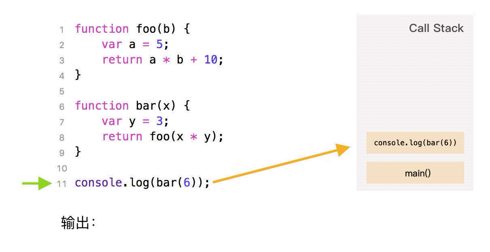

# JavaScript知识总结

## 1.1 Event Loop

### 1.1.1 进程和线程

> 这两个名词都是CPU工作时间片的一个描述。进程描述了CPU在运行指令及加载和保存上下文所需的时间，放在应用上来说就是一个程序。线程是进程中更小单位，描述了执行一段指令所需的时间。

- 比如打开一个浏览器的Tab页，这就是一个进程，一个进程可以包含多个线程，比如渲染线程，JS引擎线程，HTTP请求线程等等。（注：JS引擎线程运行时可能会阻塞UI渲染，所以JS引擎线程和渲染线程时互斥的。）

### 1.1.2 执行栈（execution stack）

> 可以把执行栈理解为一个存储函数调用的栈结构，遵循FILO(先进后出)。

```js
function foo(b) {
  var a = 5;
  return a * b + 10;
}
function bar(x) {
  var y = 3;
  return foo(x * y);
}
console.log(bar(6));
```



### 1.1.3 event loop

1. 同步和异步任务分别进入不同的执行"场所"，同步的进入主线程，异步的进入Event Table并注册函数。
2. 当指定的事情完成时，Event Table会将这个函数移入Event Queue。
3. 主线程内的任务执行完毕为空，会去Event Queue读取对应的函数，进入主线程执行。
4. 上述过程会不断重复，也就是常说的Event Loop(事件循环)。


### 1.1.4 Task Queue

> 见上一篇js_base_04.js。
