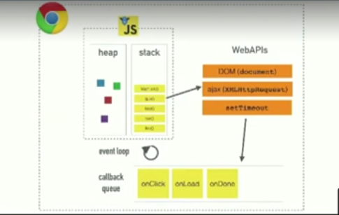
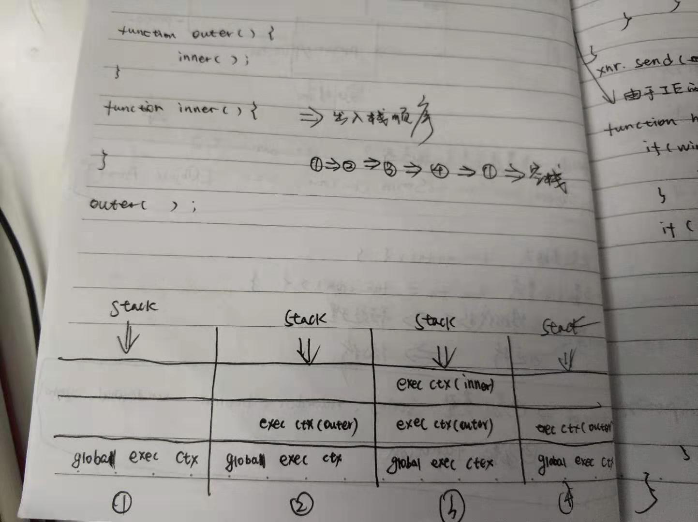

### 1.About JavaScript
1. A single-threaded;non-blocking;asynchronous;concurrent language.
2. It has a call stack,an event-loop,a callback queue,some other apis and stuff.
### 2.About V8(CORE)
1. It has a call stack and a heap.
2. But others.
### 3.event-loop
```
When executing code,the code block is firstly pushed in the call stack,and then
if there is a code block which call the WEBAPIs,let this running asynchronous,
and when it finished,enqueue the result in the task queue and wait.When there isn't
any code block in the call stack,push the result queued in the queue to the stack
and pop it out. 
```
### Relation

### Example
