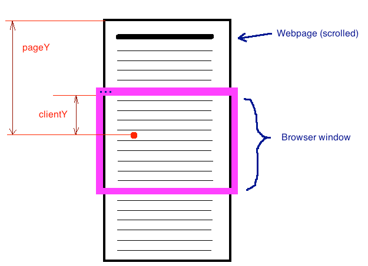
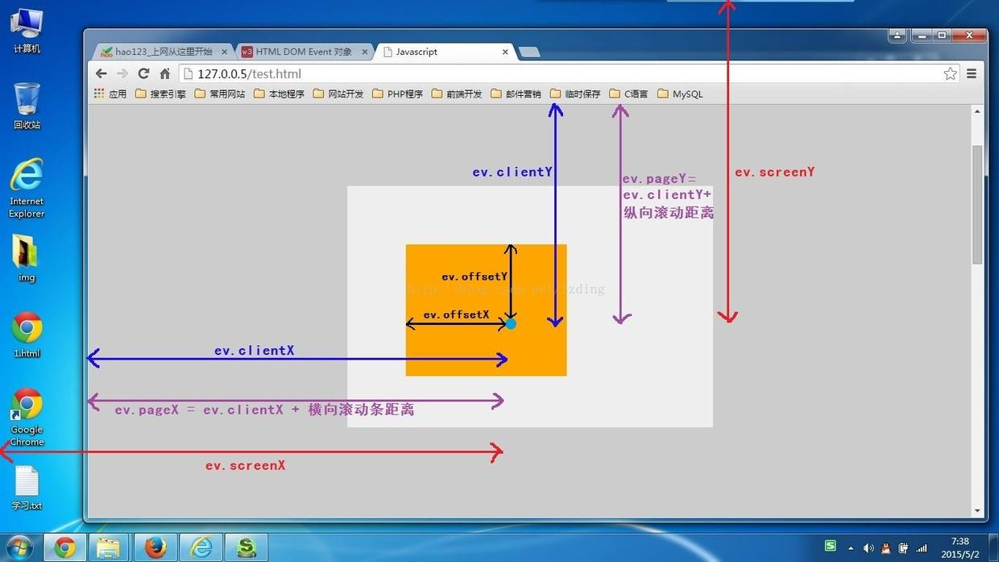

### JavaScript.event对象
##### 1.offsetX/Y
- offset意为偏移量，相对的是目标元素的坐标。
- Chrome下，offsetX/Y是包含边框的；但是ie/firefox是不包括边框的，点击border为负值。
##### clientX/Y
- 鼠标指针位置相对的是浏览器窗口（内容区域的左上角）。
- 不包括浏览器导航栏和滚动条。
##### pageX/Y
- 鼠标指针位置相对的是全呈现的内容区域左上角（全文档流）。
- 包括隐藏滚动条部分，整个渲染页面。
##### screenX/Y
- 鼠标指针位置相对的是显示屏设备左上角。
### 关系图
##### 1.clientX/Y & pageX/Y

##### 2.区别图
