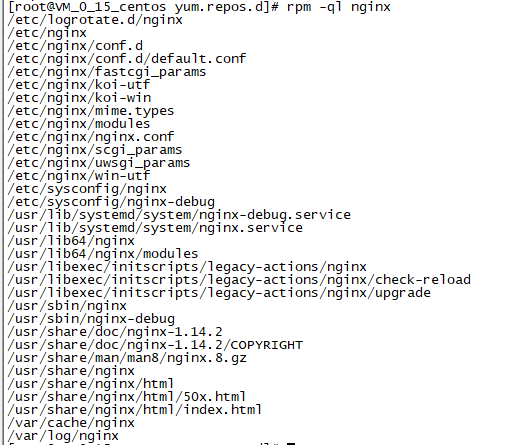
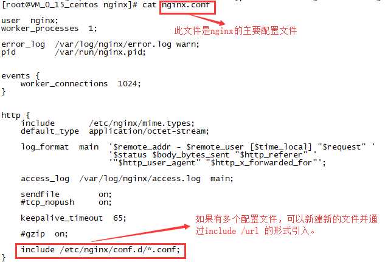

# Nginx

## 1. 获取服务器

## 2. 环境确认

### 2.1 关闭iptables

- iptables命令是Linux上常用的防火墙软件。

#### 2.1.1 停止防火墙

```js
// bash
$ systemctl stop firewalld.service
```

#### 2.1.2 永久关闭防火墙

```js
// bash
$ systemctl disable firewalld.service
```

### 2.2 停用SELinux

- 安全增强型Linux(Security-Enhanced Linux)=> SELinux。他是Linux的一个内核模块，也是Linux的一个安全子系统。

- SELinux主要作用就是最大限度地减小系统中服务进程可访问的资源（最小权限原则）。

- 临时关闭：setenforce 0

- 永久关闭：/etc/selinux/config SELINUX=enforcing=>disabled

- 查看状态：/usr/sbin/sestaus -v

### 2.3 安装依赖

```js
// bash 1
$ yum -y install gcc gcc-c++ autoconf pcre pcre-devel make automake

// bash 2
$ yum -y install wget httpd-tools vim
```

## 3. Nginx的优势

- IO多路复用 多个描述符的IO操作都能在一个线程里并发交替顺序完成，复用线程。

- CPU亲和 一种把CPU核心和Nginx工作进程绑定方式，把每个worker进程固定在一个CPU上执行，减少切换CPU和提交缓存命中率，获得更好的性能。

- sendfile 零拷贝传输模式 ![usercore]

## 4. Nginx安装

### 4.1 分类

- Mainline version 开发板

- Stable version 稳定版

- Legacy version 历史版

### 4.2 下载地址

- Nginx官网

### 4.3 安装

#### 4.3.1 创建repo文件

- [官网梯子](http://nginx.org/en/linux_packages.html#RHEL-CentOS)

```js
// 创建文件
# vi /etc/yum.repos.d/nginx.repo

// 内容
[nginx-stable]
name=nginx stable repo
baseurl=http://nginx.org/packages/centos/$releasever/$basearch/
gpgcheck=1
enabled=1
gpgkey=https://nginx.org/keys/nginx_signing.key
```

#### 4.3.2 安装

```js
//bash
# yum install nginx
```

## 5. 目录

### 5.1 安装目录

- 查看配置文件和目录

```js
// bash
# rpm -ql nginx
```

- 图示



### 5.2 配置文件

- /root => /etc/nginx

| 类型 | 文件 | 用途 |
| :------| ------: | :------: |
| 配置文件 | /etc/logrotate.d/nginx | 用于logrotate日志切割 |
| 配置文件 | /root/nginx | 主配置文件 |
| 配置文件 | /root/conf | 主配置文件 |
| 配置文件 | /root/conf.d | 主配置文件 |
| 配置文件 | /root/conf.d/default.conf | 主配置文件 |
| 配置文件 | /root/scgi_params | cgi配置 |
| 配置文件 | /root/uwsgi_params | fastcgi配置 |
| 配置文件 | /root/koi-utf/win-utf | 转码转换映射转化文件 |
| 配置文件 | /root/mime.types | http:Content-Type与扩展名对应关系 |
| 配置文件 | /root/modules;/usr/lib64/nginx/modules | nginx模块目录 |
| 命令 | /usr/share/doc/nginx-1.14.2(?/COPYRIGHT) | nginx手册和帮助文档 |
| 目录 | /var/cache/nginx | nginx的缓存目录 |
| 目录 | /var/log/nginx | nginx的日志 |

### 5.3 编译参数

#### 5.3.1 安装目录和路径

```js
nginx version: nginx/1.14.0
built by gcc 4.8.5 20150623 (Red Hat 4.8.5-28) (GCC)
built with OpenSSL 1.0.2p  14 Aug 2018
TLS SNI support enabled
configure arguments: --prefix=/usr/local/nginx --user=www --group=www --with-http_stub_status_module --with-http_v2_module --with-http_ssl_module --with-http_gzip_static_module --with-http_realip_module --with-http_flv_module --with-http_mp4_module --with-openssl=../openssl-1.0.2p --with-pcre=../pcre-8.42 --with-pcre-jit --with-ld-opt=-ljemalloc
```

#### 5.3.2 执行对应的模块时，nginx保留的临时性文件

```js
--http-client-body-temp-path=/var/cache/nginx/client_temp
--http-proxy-temp-paty=/var/cache/nginx/proxy_temp
--http-fastcgi-temp-path=/var/cache/nginx/fastcgi_temp
--http-uwsgi-temp-path=/var/cache/nginx/uwsgi_temp
--http-scgi-temp-path=/var/cache/nginx/scgi_temp
```

#### 5.3.3 设置nginx进程启动的用户和用户组

```js
--user=nginx
--group=nginx
```

## 6. 配置文件

- /etc/nginx/nginx.conf

- /etc/nginx/conf.d/*.conf => /etc/nginx/conf.d/default.conf

### 6.1 全局和服务配置



| 分类 | 配置项 | 用途 |
| :------| ------: | :------: |
| 全局 | user | 设置nginx服务的系统使用用户 |
| 全局 | worder_processes | 工作进程数，一般和CPU数量相同 |
| 全局 | error_log | nginx的错误日志 |
| 全局 | pid | nginx服务启动时的pid |

## 7. 命令

```js
// 启动
systemctl start nginx.service

// 重启
systemctl restart nginx.service
nginx -s reload

// 开机自启
systemctl enable nginx.service

// 停止开机自启
systemctl disable nginx.service

// 查看状态
systemctl status nginx.service

// 停止
systemctl stop nginx.service
nginx -s stop
nginx -s quit
```